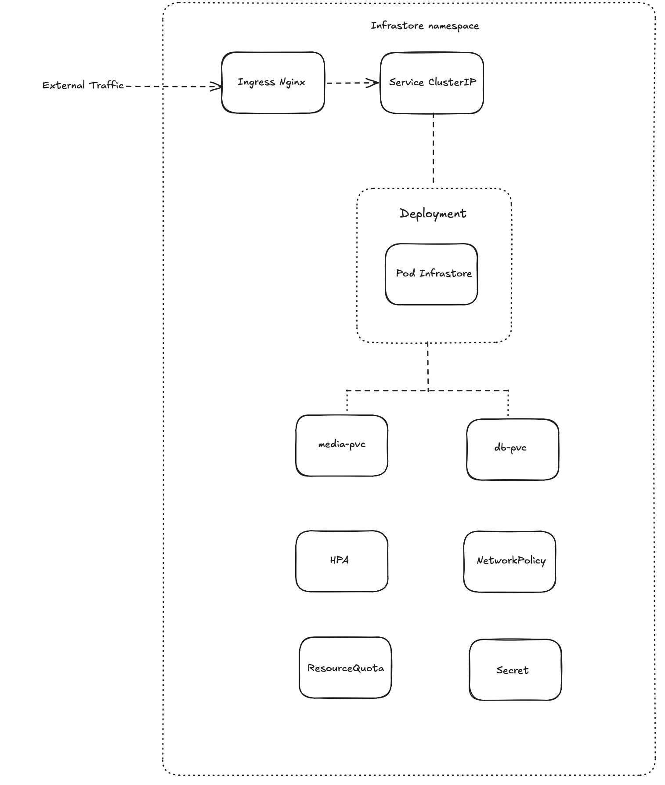

# Infrastore

## Introduction

This readme will show you my approach to the solution, how to deploy my manifest into k3s and an architectural diagram.
I'm making the assumption that you will be testing this on a mac. Happy to demo during the panel if not.


## Architecture Diagram



Made diagram light so I can explain more during panel

## Explaining Approach

### Security

- The pod runs as a non-root user and cannot change to root
- Sensitive values (admin password, Django `SECRET_KEY`) are stored in a Kubernetes Secret
- A NetworkPolicy restricts all pod traffic: ingress is only accepted from the ingress controller, and egress is locked down to DNS only
- A ResourceQuota caps the namespace, preventing any runaway workload from consuming the node

### Scalability

- A HorizontalPodAutoscaler is configured to scale on CPU and memory utilisation
- Currently capped at 1 replica due to SQLite not supporting concurrent writes, scaling beyond 1 pod would cause database corruption
- The HPA pattern is in place so that replacing SQLite with PostgreSQL is possible.

### Storage

- Two separate PersistentVolumeClaims are used, `media-pvc` for uploaded files and `db-pvc` for the SQLite database
- Keeping them separate means the database and media have independent lifecycles, you can resize, back up, or migrate them independently
- both use `ReadWriteOnce`, appropriate for a single-node setup

### Automation

- A `deploy.sh` script applies all manifests in the correct order and waits for the rollout to bed completed
- readiness and liveness probes are configured so Kubernetes automatically detects and restarts unhealthy pods without manual intervention


## How to deploy

### Prerequisite

- install multipass:
    - `brew install --cask multipass`
- launch the VM:
    - `multipass launch --name infrastore --cpus 2 --memory 2G --disk 10G`
- copy this repo into the VM (run from your Mac, inside the parent directory of this repo):
    - `multipass transfer -r ./infrastore-k3s infrastore:/home/ubuntu/`
- install k3s inside the VM:
    - `multipass shell infrastore`
    - `sudo -i`
    - `curl -sfL https://get.k3s.io | sh -`
- disable Traefik (k3s ships with Traefik by default, we replace it with nginx):
    - `echo "disable: traefik" | sudo tee /etc/rancher/k3s/config.yaml`
    - `systemctl restart k3s`
    - `kubectl delete helmchart traefik traefik-crd -n kube-system`
- install the nginx ingress controller (inside the VM):
    - `kubectl apply -f https://raw.githubusercontent.com/kubernetes/ingress-nginx/controller-v1.10.1/deploy/static/provider/cloud/deploy.yaml`
- Add the following to `/etc/hosts` to resolve `infrastore.local` to the VM (this tells your machine where to route requests for that hostname):
    - From inside the VM: `echo "<VM-IP> infrastore.local" | sudo tee -a /etc/hosts`
    - Get the VM IP with: `multipass info infrastore`

### Deployment

Shell into the VM and run the deploy script:

```sh
multipass shell infrastore
sudo -i
cp -r /home/ubuntu/infrastore-k3s ~/
cd ~/infrastore-k3s
chmod +x deploy.sh
./deploy.sh
```

Verify the pod is running:

```sh
kubectl get all -n infrastore
```

Wait until the pod shows `1/1 Running`.

### Testing the API

Get an auth token:

```bash
curl -X POST http://infrastore.local/api/token/ \
  -d "username=admin&password=secret123"
```

Upload a file:

```bash
echo "hello world" > example.txt
curl -X POST http://infrastore.local/api/upload/ \
  -H "Authorization: Token YOUR_TOKEN" \
  -F "file=@example.txt"
```

List files:

```bash
curl http://infrastore.local/api/files/ \
  -H "Authorization: Token YOUR_TOKEN"
```

Delete a file:

```bash
curl -X DELETE http://infrastore.local/api/files/1/ \
  -H "Authorization: Token YOUR_TOKEN"
```
